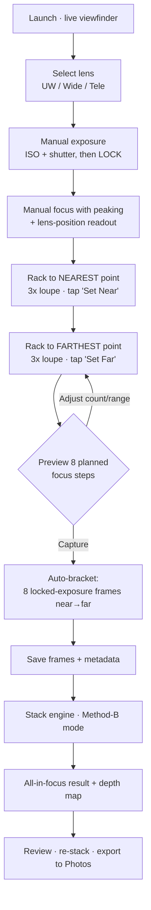
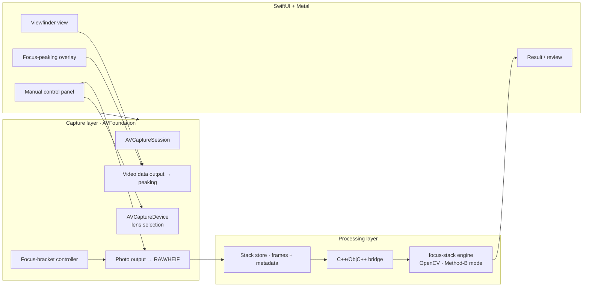

# StackShot — iOS Manual Focus-Stacking Camera

**Engineering blueprint (design only — no implementation yet)**

Version 0.1 · Target platform: iOS 17+ · Primary use case: macro focus stacking of
stationary subjects (e.g. a fly reel inside a light box).

---

## 1. What we're building

A manual-control camera app that lets a photographer:

1. **Pick the lens** (ultra-wide / wide / telephoto — whichever back cameras the device exposes).
2. **Set focus manually** and *see* where the plane of focus currently sits (focus peaking + a lens-position/distance readout).
3. **Set exposure manually** (ISO + shutter speed), locked so every frame in a stack matches.
4. Rack focus to the **nearest** point of the subject and mark it, then to the **farthest** point and mark it.
5. Tap capture — the app shoots **8 frames evenly spaced** across that near→far focus range, holding exposure constant.
6. **Stack them in-app** using an embedded open-source engine tuned to behave like **Helicon Focus "Method B" (depth-map)**, which is the mode Helicon recommends for well-defined, stationary subjects.

The output is a single all-in-focus image (plus an optional depth map), saved to the photo library.

> This document is the blueprint only. Code sketches below are illustrative of the intended
> API usage, not the final implementation.

---

## 2. Why "Method B" and how we match it with open source

Helicon Focus offers three rendering methods:

| Helicon method | Idea | Best for |
| --- | --- | --- |
| **A** — weighted average | Weights each pixel by local contrast, averages the whole stack | Short stacks; preserves color/contrast |
| **B** — depth map | For each pixel, picks the *single sharpest source frame*, builds a depth map, renders from it | Smooth surfaces & **well-defined stationary subjects** — our case |
| **C** — pyramid | Splits into frequency bands and fuses | Deep/complex stacks, intersecting objects (can raise glare/contrast) |

Method B requires the frames to be in **consecutive focus order**, which our capture flow
guarantees by construction (we march the lens from near to far).

**Chosen engine:** [`PetteriAimonen/focus-stack`](https://github.com/PetteriAimonen/focus-stack)

- **License: MIT** — safe to embed and ship.
- Written in **C++**, single dependency: **OpenCV** (Apache-2.0).
- Aligns frames with `findTransformECC`, fuses using the complex-wavelet extended-depth-of-field
  method (Forster/Van De Ville/Berent/Sage/Unser), and can emit a **depth map**
  (`--depthmap`) and a sharpest-source selection per pixel.

The "sharpest source per pixel + depth map" behavior is the direct open-source analog of
Helicon **Method B**. We will drive it in that mode (per-pixel best-frame selection with the
depth map produced), rather than a pure averaging mode.

### Alternatives considered

| Option | License | Notes |
| --- | --- | --- |
| **PetteriAimonen/focus-stack** ✅ | MIT | Fast, depth-map capable, minimal deps — **selected** |
| Enfuse / align_image_stack (Hugin) | GPL | Excellent quality but GPL complicates App Store distribution |
| OpenCV-only custom (Laplacian pyramid merge) | Apache-2.0 | Full control, but we'd re-implement alignment + fusion from scratch |
| Petteri's Sobel depth-mapper / tonyketcham Depth-Mapper | MIT | Reference for depth-map math only |

**License posture:** MIT + Apache-2.0 only in the shipping binary. GPL libraries are explicitly
avoided so the app can go on the App Store without source-disclosure obligations. Every
third-party license text ships in an in-app "Acknowledgements" screen.

---

## 3. Device & OS assumptions

- iOS 17+ (for the latest `AVCaptureDevice` manual-control and multi-cam APIs).
- Physical device required — the Simulator has no camera.
- Manual focus (`setFocusModeLocked(lensPosition:)`) and manual exposure
  (`setExposureModeCustom(duration:ISO:)`) are available on all modern iPhones.
- **RAW/DNG** capture where the device supports it (`AVCapturePhotoOutput.availableRawPhotoPixelFormatTypes`),
  falling back to full-res HEIF/JPEG.
- **Distance readout caveat:** iOS does *not* expose an absolute focus distance in meters from
  the lens. `lensPosition` is a **relative [0.0 … 1.0]** value that is monotonic with focus
  distance but non-linear. On LiDAR-equipped devices we can *additionally* sample
  `AVDepthData` to show an approximate distance in the focus reticle. See §7 for the spacing math.

---

## 4. End-to-end user flow



Key guarantees:
- Exposure (ISO, shutter, white balance) is **locked** before capture so all 8 frames match —
  no exposure drift across the stack, which would confuse the fusion.
- The lens is driven in a **monotonic near→far sweep** so frames are already in the consecutive
  order Method B needs.

---

## 5. System architecture



### Layering
- **Presentation** — SwiftUI for panels/nav; a Metal (`MTKView`) or `AVCaptureVideoPreviewLayer`
  surface for the live feed and the focus-peaking overlay.
- **Capture** — a `CameraService` actor wrapping `AVCaptureSession`, device/lens management,
  manual focus/exposure, and the focus-bracket sequencer.
- **Processing** — a `StackStore` that persists each capture set, and a thin **Objective-C++**
  bridge that hands OpenCV `cv::Mat`s to the C++ `focus-stack` core off the main thread.

---

## 6. Module breakdown

### 6.1 Lens selection — `CameraService.selectLens`
Enumerate physical cameras with an `AVCaptureDevice.DiscoverySession`:

```swift
// Illustrative only
let discovery = AVCaptureDevice.DiscoverySession(
    deviceTypes: [.builtInUltraWideCamera, .builtInWideAngleCamera, .builtInTelephotoCamera],
    mediaType: .video, position: .back)
// Present discovery.devices as selectable "lenses".
```
Switching lens reconfigures the session inside `beginConfiguration()/commitConfiguration()`.
The macro use case will usually favor the **wide** or **telephoto** module; ultra-wide is
offered for larger reels/boxes.

### 6.2 Manual exposure — `CameraService.setExposure`
```swift
try device.lockForConfiguration()
device.setExposureModeCustom(duration: shutter, iso: iso) { _ in }
device.setWhiteBalanceModeLocked(with: currentGains) { _ in }
device.unlockForConfiguration()
```
- UI sliders for **ISO** (`device.activeFormat.minISO…maxISO`) and **shutter**
  (`minExposureDuration…maxExposureDuration`), shown as familiar 1/x values.
- A live **histogram + EV meter** derived from the video-data-output frames so the user can
  nail exposure before locking.
- Once set, exposure/WB are **locked for the whole stack**.

### 6.3 Manual focus + "where is it focused" — `FocusController`
- Focus slider maps to `setFocusModeLocked(lensPosition:)`, `lensPosition ∈ [0,1]`.
- **Focus peaking overlay:** iOS has no built-in peaking, so we compute it ourselves — run a
  Sobel/edge filter (Metal shader or Core Image `CIEdges`) on each preview frame and paint
  high-contrast (in-focus) edges in a bright color. This is the "show me where the lens is
  focused" feature.
- **Readout reticle:** shows the current `lensPosition` (0–1), a coarse near↔far scale, and —
  on LiDAR devices — an approximate distance sampled from `AVDepthData` at the reticle point.

### 6.4 Defining the stack range — near & far anchors
- **Set Near:** user racks focus to the closest sharp part of the reel; we store
  `lensPositionNear`.
- **Set Far:** user racks to the farthest part; we store `lensPositionFar`.
- We validate `near ≠ far` and show a live preview of the planned step planes.
- The 8 frames are captured with **inclusive endpoints**: frame 1 sits exactly on
  `lensPositionNear` and frame 8 exactly on `lensPositionFar`.

### 6.4a Focus loupe (3× magnifier) — `FocusLoupe`
Confirming critical focus on a phone screen is hard, so while the user is setting the Near/Far
anchors (and any time manual focus is active) the app shows a **3× magnified loupe** of the
region under the reticle:
- A circular, draggable magnifier that samples the **full-resolution** center of the sensor feed
  (not just the downscaled preview) so real sharpness is visible, with the **focus-peaking
  overlay applied inside it**.
- Default **3×**; pinch to change (2×–6×). Tap-to-move the sampled point, or lock it to screen
  center.
- Auto-shows on focus interaction, auto-hides after capture. Implemented as a Metal-sampled crop
  of the video-data-output frame — no extra capture cost.

### 6.5 The 8-frame even-spacing sequencer — `FocusBracketController`
Default **8 steps** (configurable 3–20), inclusive of both endpoints:

```
for i in 0..<N:
    t   = i / (N - 1)                      # 0 … 1
    pos = interpolate(near, far, t)        # see §7 for linear-vs-diopter option
    setFocusModeLocked(lensPosition: pos)
    await focusSettled(device)             # KVO on `adjustingFocus` / lensPosition delta
    capturePhoto(settings: lockedRAWSettings)
```
- Waits for the lens to actually **settle** at each step (KVO on `lensPosition` /
  `isAdjustingFocus`) before firing — never fires mid-move.
- Exposure stays locked; only focus changes between frames.
- Emits progress (`3 / 8`) to the UI and can be cancelled.

### 6.6 Capture & storage — `StackStore`
- Prefer **RAW (DNG)**; fall back to max-resolution HEIF.
- Each frame tagged with `{index, lensPosition, ISO, shutter, timestamp, lensID}`.
- One capture session = one on-disk `StackSet` folder (frames + `manifest.json`) so a stack can
  be re-processed later without re-shooting.

### 6.7 Stacking engine bridge — `StackEngine`
- OpenCV iOS framework + the `focus-stack` C++ core compiled for `arm64`.
- An **Objective-C++ (`.mm`)** bridge exposes a Swift-callable
  `stack(frames:options:) async -> StackResult`.
- Runs on a background queue; reports progress; returns the merged image **and** the depth map.
- Configured for the **Method-B analog**: per-pixel sharpest-source selection with depth-map
  output and ECC alignment enabled (subjects are stationary but a light-box + handheld phone
  still benefits from alignment).

---

## 7. Focus-step spacing math (the important detail)

The user's intent is **evenly spaced *planes of focus*** from the near point to the far point.
There are two ways to interpolate between `lensPositionNear` and `lensPositionFar`:

1. **Linear in `lensPosition`** — simplest; spacing in the 0–1 device value is uniform.
   Because Apple's `lensPosition` is only *approximately* linear with distance, the real-world
   plane spacing is roughly even and is the sane v1 default.
2. **Linear in diopters (1/distance)** — depth-of-field per focus step is more naturally uniform
   in *diopter* space than in distance. If/when we can map `lensPosition → distance` (via LiDAR
   sampling or a per-device calibration table), we interpolate evenly in `1/distance` so the
   in-focus slabs tile the subject without gaps or wasteful overlap.

**Plan:** ship v1 with **linear-in-lensPosition** (option 1); diopter-even spacing (option 2) is
**deferred** to M6 behind a toggle once per-device calibration exists. Also expose an **overlap
safety factor** so adjacent frames' depth-of-field slabs slightly overlap — critical to avoid
unsharp bands in the final stack.

**Endpoints are inclusive (confirmed):** frame 1 = `lensPositionNear`, frame 8 = `lensPositionFar`,
with the remaining 6 evenly spaced between them.

---

## 8. Data model

```
StackSet
├── id, createdAt, deviceModel, lensID
├── exposure: { iso, shutterSeconds, whiteBalanceGains }
├── range: { lensPositionNear, lensPositionFar, stepCount, spacingMode }
├── frames: [ Frame { index, lensPosition, fileURL(dng/heif), capturedAt } ]
└── result: { mergedImageURL, depthMapURL, engineOptions, processedAt } | nil
```

Persisted to the app sandbox; `manifest.json` per set. Results are optional so a set can be
re-stacked with different engine options.

---

## 9. Screens (UX)

1. **Viewfinder** — live feed, peaking overlay, lens picker chips, exposure/focus toggles,
   big shutter button.
2. **Exposure panel** — ISO + shutter sliders, histogram, EV meter, "Lock" button.
3. **Focus panel** — focus slider + reticle readout, **3× focus loupe** for confirming sharpness,
   **Set Near** / **Set Far** buttons, a planned-steps strip showing the 8 focus planes.
4. **Capture progress** — "Frame 3 / 8", cancel.
5. **Review** — merged result with a **before/after** and per-frame filmstrip, **Re-stack**
   (change method/steps), depth-map view, **Export to Photos / Share**.
6. **Library** — saved StackSets, re-open to re-process.
7. **Acknowledgements** — third-party licenses (OpenCV Apache-2.0, focus-stack MIT).

---

## 10. Tech stack & dependencies

| Concern | Choice |
| --- | --- |
| Language / UI | Swift 5.9+, SwiftUI, Metal/Core Image for peaking |
| Camera | AVFoundation (`AVCaptureSession`, manual focus/exposure, RAW) |
| Depth (optional) | ARKit / `AVDepthData` on LiDAR devices |
| Stacking core | `PetteriAimonen/focus-stack` (MIT), C++ |
| Image ops | OpenCV for iOS (Apache-2.0) |
| Interop | Objective-C++ (`.mm`) bridge |
| Persistence | File-system StackSets + JSON manifests |
| Min iOS | 17.0 |

**Privacy / Info.plist:** `NSCameraUsageDescription`, `NSPhotoLibraryAddUsageDescription`.

---

## 11. Phased roadmap

- **M0 — Skeleton:** Xcode project, camera permission, live viewfinder, lens picker.
- **M1 — Manual controls:** ISO/shutter/WB lock + histogram; manual focus slider + lens-position
  readout.
- **M2 — Focus peaking + loupe:** Metal/Core Image edge overlay and the 3× full-res focus loupe.
- **M3 — Bracket sequencer:** Set Near/Far, 8-step monotonic sweep with settle-wait, locked
  exposure, RAW capture, StackSet storage.
- **M4 — Engine integration:** OpenCV + focus-stack compiled for arm64, `.mm` bridge, Method-B
  merge + depth map, background processing.
- **M5 — Review & export:** before/after, re-stack options, Photos export, acknowledgements.
- **M6 — Polish:** diopter-even spacing + calibration, overlap safety factor, LiDAR distance
  readout, presets.

---

## 12. Risks & open questions

| Risk / question | Mitigation |
| --- | --- |
| `lensPosition` isn't linear with distance | v1 linear default; diopter-even + calibration in M6 |
| No built-in focus peaking API | Implement with Sobel/`CIEdges` on preview frames |
| No absolute distance except on LiDAR | Show relative scale; distance only where LiDAR exists |
| Building OpenCV + C++ for arm64 in-app | Pin OpenCV iOS framework; isolate in `.mm` bridge; CI build |
| GPL contamination | Only MIT/Apache-2.0 ship; Enfuse/Hugin excluded |
| Handheld micro-motion between frames | Enable ECC alignment; recommend tripod + timer/remote |
| Confirming sharpness on small screen | 3× focus loupe sampling full-res feed with peaking (§6.4a) |
| App Store: is on-device the only mode? | Yes — no network/cloud stacking in scope |

## 13. Testing

- **Unit:** spacing math (linear + diopter), settle-detection state machine, manifest I/O.
- **Snapshot:** peaking overlay against reference frames.
- **Integration:** scripted near/far → 8-frame capture on a device rig; verify monotonic
  lensPosition and constant exposure EXIF across frames.
- **Engine golden tests:** a fixed input stack → expected merged output within tolerance;
  depth-map sanity.
- **Field test:** the actual fly-reel-in-light-box subject.

---

### Sources
- Helicon Focus methods (A/B/C): <https://www.heliconsoft.com/helicon-focus-main-parameters/>
- focus-stack (MIT, OpenCV, depth map): <https://github.com/PetteriAimonen/focus-stack>
- Algorithm background (complex wavelets EDF; ECC alignment): focus-stack `docs/Algorithms.md`
