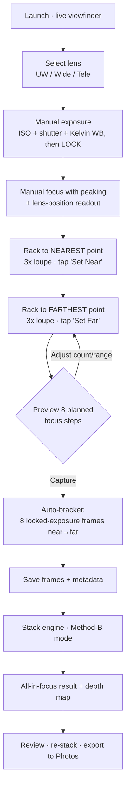
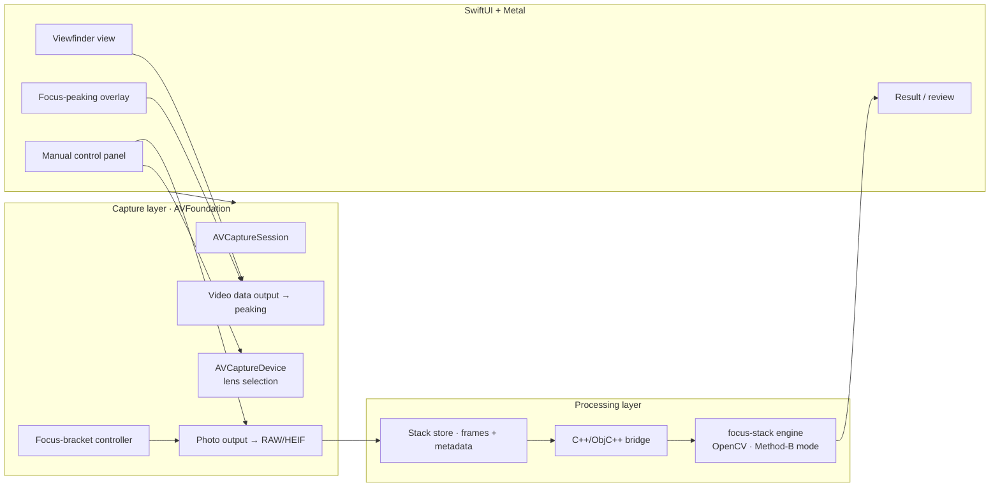

# StackShot — iOS Manual Focus-Stacking Camera

**Engineering blueprint — implemented. See §14 for what shipped beyond this design.**

Version 0.2 · Target platform: iOS 17+ · Primary use case: macro focus stacking of
stationary subjects (e.g. a fly reel inside a light box).

Status: the app in `ios/StackShot/` implements this design. It builds and its unit
tests pass in CI, and a second CI job compile-checks the embedded C++ engine path.
It has **not yet run on a phone** — no on-device behaviour is validated.

---

## 1. What we're building

A manual-control camera app that lets a photographer:

1. **Pick the lens** (ultra-wide / wide / telephoto — whichever back cameras the device exposes).
2. **Set focus manually** and *see* where the plane of focus currently sits (focus peaking + a lens-position/distance readout).
3. **Set exposure manually** (ISO + shutter speed), locked so every frame in a stack matches.
4. Rack focus to the **nearest** point of the subject and mark it, then to the **farthest** point and mark it.
5. Tap capture — the app shoots **8 frames evenly spaced** across that near→far focus range, holding exposure constant.
6. **Stack them in-app** using an embedded open-source engine tuned to behave like **Helicon Focus "Method B" (depth-map)**, which is the mode Helicon recommends for well-defined, stationary subjects.

The output is a single all-in-focus image (plus an optional depth map), saved to the photo library.

> Sections 1–13 are the original design and its rationale, preserved because the
> reasoning (Method-B mapping, spacing math, licensing) still governs the app. Code
> sketches are illustrative; consult the source for exact APIs. Section 14 records
> where the shipped app diverges from or extends this plan.

---

## 2. Why "Method B" and how we match it with open source

Helicon Focus offers three rendering methods:

| Helicon method | Idea | Best for |
| --- | --- | --- |
| **A** — weighted average | Weights each pixel by local contrast, averages the whole stack | Short stacks; preserves color/contrast |
| **B** — depth map | For each pixel, picks the *single sharpest source frame*, builds a depth map, renders from it | Smooth surfaces & **well-defined stationary subjects** — our case |
| **C** — pyramid | Splits into frequency bands and fuses | Deep/complex stacks, intersecting objects (can raise glare/contrast) |

Method B requires the frames to be in **consecutive focus order**, which our capture flow
guarantees by construction (we march the lens from near to far).

**Chosen engine:** [`PetteriAimonen/focus-stack`](https://github.com/PetteriAimonen/focus-stack)

- **License: MIT** — safe to embed and ship.
- Written in **C++**, single dependency: **OpenCV** (Apache-2.0).
- Aligns frames with `findTransformECC`, fuses using the complex-wavelet extended-depth-of-field
  method (Forster/Van De Ville/Berent/Sage/Unser), and can emit a **depth map**
  (`--depthmap`) and a sharpest-source selection per pixel.

The "sharpest source per pixel + depth map" behavior is the direct open-source analog of
Helicon **Method B**. We will drive it in that mode (per-pixel best-frame selection with the
depth map produced), rather than a pure averaging mode.

### Alternatives considered

| Option | License | Notes |
| --- | --- | --- |
| **PetteriAimonen/focus-stack** ✅ | MIT | Fast, depth-map capable, minimal deps — **selected** |
| Enfuse / align_image_stack (Hugin) | GPL | Excellent quality but GPL complicates App Store distribution |
| OpenCV-only custom (Laplacian pyramid merge) | Apache-2.0 | Full control, but we'd re-implement alignment + fusion from scratch |
| Petteri's Sobel depth-mapper / tonyketcham Depth-Mapper | MIT | Reference for depth-map math only |

**License posture:** MIT + Apache-2.0 only in the shipping binary. GPL libraries are explicitly
avoided so the app can go on the App Store without source-disclosure obligations. Every
third-party license text ships in an in-app "Acknowledgements" screen.

---

## 3. Device & OS assumptions

- iOS 17+ (for the latest `AVCaptureDevice` manual-control and multi-cam APIs).
- Physical device required — the Simulator has no camera.
- Manual focus (`setFocusModeLocked(lensPosition:)`) and manual exposure
  (`setExposureModeCustom(duration:ISO:)`) are available on all modern iPhones.
- **RAW/DNG** capture where the device supports it (`AVCapturePhotoOutput.availableRawPhotoPixelFormatTypes`),
  falling back to full-res HEIF/JPEG.
- **Capture assumptions (confirmed):** rig is **tripod/mount-mounted** (subject and phone
  stationary); outputs are the **8 RAW/DNG frames + final stacked HEIF/JPEG**; frame count is
  **adjustable, default 8**.
- **Distance readout caveat:** iOS does *not* expose an absolute focus distance in meters from
  the lens. `lensPosition` is a **relative [0.0 … 1.0]** value that is monotonic with focus
  distance but non-linear. On LiDAR-equipped devices we can *additionally* sample
  `AVDepthData` to show an approximate distance in the focus reticle. See §7 for the spacing math.

---

## 4. End-to-end user flow



Key guarantees:
- Exposure (ISO, shutter, white balance) is **locked** before capture so all 8 frames match —
  no exposure drift across the stack, which would confuse the fusion.
- The lens is driven in a **monotonic near→far sweep** so frames are already in the consecutive
  order Method B needs.

---

## 5. System architecture



### Layering
- **Presentation** — SwiftUI for panels/nav; a Metal (`MTKView`) or `AVCaptureVideoPreviewLayer`
  surface for the live feed and the focus-peaking overlay.
- **Capture** — a `CameraService` actor wrapping `AVCaptureSession`, device/lens management,
  manual focus/exposure, and the focus-bracket sequencer.
- **Processing** — a `StackStore` that persists each capture set, and a thin **Objective-C++**
  bridge that hands OpenCV `cv::Mat`s to the C++ `focus-stack` core off the main thread.

---

## 6. Module breakdown

### 6.1 Lens selection — `CameraService.selectLens`
Enumerate physical cameras with an `AVCaptureDevice.DiscoverySession`:

```swift
// Illustrative only
let discovery = AVCaptureDevice.DiscoverySession(
    deviceTypes: [.builtInUltraWideCamera, .builtInWideAngleCamera, .builtInTelephotoCamera],
    mediaType: .video, position: .back)
// Present discovery.devices as selectable "lenses".
```
Switching lens reconfigures the session inside `beginConfiguration()/commitConfiguration()`.
The macro use case will usually favor the **wide** or **telephoto** module; ultra-wide is
offered for larger reels/boxes.

### 6.2 Manual exposure — `CameraService.setExposure`

Two independent things the user controls, both held constant across the 8-frame stack:

**(a) Brightness / EV** — via ISO + shutter:
```swift
try device.lockForConfiguration()
device.setExposureModeCustom(duration: shutter, iso: iso) { _ in }
device.unlockForConfiguration()
```
- UI sliders for **ISO** (`device.activeFormat.minISO…maxISO`) and **shutter**
  (`minExposureDuration…maxExposureDuration`), shown as familiar 1/x values.
- A live **histogram + EV meter** derived from the video-data-output frames so the user can
  nail exposure before locking. (EV — e.g. 2.7 — is *brightness*, not color; it's the ISO/shutter
  combination, and it's a separate control from white balance below.)

**(b) Color temperature / white balance (Kelvin)** — for the light box:
```swift
// Set a fixed Kelvin (e.g. 5000K) so light-box color is neutral and identical every frame
let tt = AVCaptureDevice.WhiteBalanceTemperatureAndTintValues(temperature: kelvin, tint: tint)
var gains = device.deviceWhiteBalanceGains(for: tt)
gains = clampToSupportedRange(gains, device)   // guard against maxWhiteBalanceGain
device.setWhiteBalanceModeLocked(with: gains) { _ in }
```
- A **Kelvin slider** (~2500K–8000K) plus a fine **tint** control, with quick presets
  (Daylight 5600K, LED panel 5000K, Tungsten 3200K) since light boxes vary.
- Optional **one-tap gray-card lock**: point at a white/gray card in the box and lock neutral WB,
  which we then read back as a Kelvin value for reference.

Once set, **both EV and Kelvin white balance are locked for the entire stack** — no exposure or
color drift between frames, which is what keeps the fused result clean.

### 6.3 Manual focus + "where is it focused" — `CameraService` + `PreviewFrameProcessor`
- Focus slider maps to `setFocusModeLocked(lensPosition:)`, `lensPosition ∈ [0,1]`.
- **Focus peaking overlay:** iOS has no built-in peaking, so we compute it ourselves — run a
  Sobel/edge filter (Metal shader or Core Image `CIEdges`) on each preview frame and paint
  high-contrast (in-focus) edges in a bright color. This is the "show me where the lens is
  focused" feature.
- **Readout reticle:** shows the current `lensPosition` (0–1), a coarse near↔far scale, and —
  on LiDAR devices — an approximate distance sampled from `AVDepthData` at the reticle point.

### 6.4 Defining the stack range — near & far anchors
- **Set Near:** user racks focus to the closest sharp part of the reel; we store
  `lensPositionNear`.
- **Set Far:** user racks to the farthest part; we store `lensPositionFar`.
- We validate `near ≠ far` and show a live preview of the planned step planes.
- The 8 frames are captured with **inclusive endpoints**: frame 1 sits exactly on
  `lensPositionNear` and frame 8 exactly on `lensPositionFar`.

### 6.4a Focus loupe (3× magnifier) — `FocusLoupe`
Confirming critical focus on a phone screen is hard, so while the user is setting the Near/Far
anchors (and any time manual focus is active) the app shows a **3× magnified loupe** of the
region under the reticle:
- A circular, draggable magnifier that samples the **full-resolution** center of the sensor feed
  (not just the downscaled preview) so real sharpness is visible, with the **focus-peaking
  overlay applied inside it**.
- Default **3×**; pinch to change (2×–6×). Tap-to-move the sampled point, or lock it to screen
  center.
- Auto-shows on focus interaction, auto-hides after capture. Implemented as a Metal-sampled crop
  of the video-data-output frame — no extra capture cost.

### 6.5 The 8-frame even-spacing sequencer — `FocusBracketController`
Default **8 steps** (adjustable 3–20), inclusive of both endpoints. Because the rig is
**tripod-mounted**, the sequencer auto-fires all frames back-to-back with a short
settle-delay per step and an optional 2 s start timer to damp any button-press shake — no
per-frame user interaction:

```
for i in 0..<N:
    t   = i / (N - 1)                      # 0 … 1
    pos = interpolate(near, far, t)        # see §7 for linear-vs-diopter option
    setFocusModeLocked(lensPosition: pos)
    await focusSettled(device)             # KVO on `adjustingFocus` / lensPosition delta
    capturePhoto(settings: lockedRAWSettings)
```
- Waits for the lens to actually **settle** at each step (KVO on `lensPosition` /
  `isAdjustingFocus`) before firing — never fires mid-move.
- Exposure stays locked; only focus changes between frames.
- Emits progress (`3 / 8`) to the UI and can be cancelled.

### 6.6 Capture & storage — `StackStore`
- Capture **RAW (DNG)** for the 8 source frames (fall back to max-res HEIF on devices without RAW).
- Outputs saved: the **8 RAW/DNG source frames** *and* the **final stacked HEIF/JPEG**. The depth
  map is produced internally to drive the Method-B merge but is not exported by default (toggle
  available later).
- Each frame tagged with `{index, lensPosition, ISO, shutter, kelvin, timestamp, lensID}`.
- One capture session = one on-disk `StackSet` folder (RAW frames + merged result +
  `manifest.json`) so a stack can be re-processed later without re-shooting.

### 6.7 Stacking engine bridge — `StackEngine`
- OpenCV iOS framework + the `focus-stack` C++ core compiled for `arm64`.
- An **Objective-C++ (`.mm`)** bridge exposes a Swift-callable
  `stack(frames:options:) async -> StackResult`.
- Runs on a background queue; reports progress; returns the merged image **and** the depth map.
- Configured for the **Method-B analog**: per-pixel sharpest-source selection with depth-map
  output and ECC alignment enabled (subjects are stationary but a light-box + handheld phone
  still benefits from alignment).

---

## 7. Focus-step spacing math (the important detail)

The user's intent is **evenly spaced *planes of focus*** from the near point to the far point.
There are two ways to interpolate between `lensPositionNear` and `lensPositionFar`:

1. **Linear in `lensPosition`** — simplest; spacing in the 0–1 device value is uniform.
   Because Apple's `lensPosition` is only *approximately* linear with distance, the real-world
   plane spacing is roughly even and is the sane v1 default.
2. **Linear in diopters (1/distance)** — depth-of-field per focus step is more naturally uniform
   in *diopter* space than in distance. If/when we can map `lensPosition → distance` (via LiDAR
   sampling or a per-device calibration table), we interpolate evenly in `1/distance` so the
   in-focus slabs tile the subject without gaps or wasteful overlap.

**Plan:** ship v1 with **linear-in-lensPosition** (option 1); diopter-even spacing (option 2) is
**deferred** to M6 behind a toggle once per-device calibration exists. Also expose an **overlap
safety factor** so adjacent frames' depth-of-field slabs slightly overlap — critical to avoid
unsharp bands in the final stack.

**Endpoints are inclusive (confirmed):** frame 1 = `lensPositionNear`, frame 8 = `lensPositionFar`,
with the remaining 6 evenly spaced between them.

---

## 8. Data model

As shipped (`Sources/Models/StackSet.swift`):

```
StackSet
├── id, createdAt, deviceModel, lensID
├── exposure: { iso, shutterSeconds, evBias? }   # metered result + dialled bias
├── whiteBalance: { kelvin, tint }
├── range: { lensPositionNear, lensPositionFar, stepCount }
├── frames: [ Frame { index, lensPosition, fileName (dng|heic), capturedAt } ]
└── result: { mergedFileName, engine, processedAt, depthMapFileName? } | nil
```

One directory per set in the app sandbox, holding `manifest.json` plus the merged image
(and the depth map, while that diagnostic is retained). `result` is nil until stacking
succeeds; once it is set, the frame *files* are gone even though `frames` still records
their metadata — the manifest stays the capture record. New fields are added as
optionals so older manifests keep decoding.

---

## 9. Screens (UX)

1. **Viewfinder** — live feed, peaking overlay, lens picker chips, exposure/focus toggles,
   big shutter button.
2. **Exposure panel** — a single **EV** slider (positive-only) biasing the camera's own
   metering, plus a histogram; a **Kelvin + tint** white-balance
   slider with presets and gray-card lock; a single "Lock" for both.
3. **Focus panel** — focus slider + reticle readout, **3× focus loupe** for confirming sharpness,
   **Set Near** / **Set Far** buttons, a planned-steps strip showing the 8 focus planes.
4. **Capture progress** — "Frame 3 / 8", cancel.
5. **Review** — merged result, depth-map view, capture settings, share. No filmstrip or
   re-stack: source frames are deleted once a stack succeeds (§14).
6. **Library** — saved stacks: browse, export, swipe-delete.
6b. **Settings** — output format (JPEG/PNG), auto-save to Photos, 1:1 crop guide.
7. **Acknowledgements** — third-party licenses (OpenCV Apache-2.0, focus-stack MIT).

---

## 10. Tech stack & dependencies

| Concern | Choice |
| --- | --- |
| Language / UI | Swift 5.9+, SwiftUI, Metal/Core Image for peaking |
| Camera | AVFoundation (`AVCaptureSession`, manual focus/exposure, RAW) |
| Depth (optional) | ARKit / `AVDepthData` on LiDAR devices |
| Stacking core | `PetteriAimonen/focus-stack` (MIT), C++ |
| Image ops | OpenCV for iOS (Apache-2.0) |
| Interop | Objective-C++ (`.mm`) bridge |
| Persistence | File-system StackSets + JSON manifests |
| Min iOS | 17.0 |

**Privacy / Info.plist:** `NSCameraUsageDescription`, `NSPhotoLibraryAddUsageDescription`.

---

## 11. Phased roadmap — status

- **M0 ✅ Skeleton:** Xcode project, camera permission, live viewfinder, lens picker.
- **M1 ✅ Manual controls:** ISO/shutter/WB lock + histogram; manual focus slider + lens-position
  readout.
- **M2 ✅ Focus peaking + loupe:** Metal/Core Image edge overlay and the 3× full-res focus loupe.
- **M3 ✅ Bracket sequencer:** Set Near/Far, 8-step monotonic sweep with settle-wait, locked
  exposure, RAW capture, StackSet storage.
- **M4 ◐ Engine integration:** (compiles + links in CI; not yet enabled in the app target) OpenCV + focus-stack compiled for arm64, `.mm` bridge, Method-B
  merge + depth map, background processing.
- **M5 ✅ Review & export:** before/after, re-stack options, Photos export, acknowledgements.
- **M6 ☐ Polish:** diopter-even spacing + calibration, overlap safety factor, LiDAR distance
  readout, presets.

---

## 12. Risks & open questions

| Risk / question | Mitigation |
| --- | --- |
| `lensPosition` isn't linear with distance | v1 linear default; diopter-even + calibration in M6 |
| ~~No built-in focus peaking API~~ | RESOLVED — `CIEdges` threshold + tint in `PreviewFrameProcessor` |
| No absolute distance except on LiDAR | Open — lens position is shown as a relative 0–1 value; LiDAR readout not implemented |
| ~~Building OpenCV + C++ for arm64 in-app~~ | RESOLVED — the `build-engine` CI job compiles and links it on every push |
| GPL contamination | Only MIT/Apache-2.0 ship; Enfuse/Hugin excluded |
| Frame-to-frame shift (focus breathing on tripod) | ECC alignment stays on to correct macro focus-breathing scale changes even when mounted; 2 s start timer damps button shake |
| ~~Confirming sharpness on small screen~~ | RESOLVED — 3× loupe (§6.4a), plus a zebra overlay for blown highlights |
| App Store: is on-device the only mode? | Yes — no network/cloud stacking in scope |

## 13. Testing

**Implemented** (`ios/StackShot/Tests/`, run on every push by
`.github/workflows/ios-tests.yml`). Coverage is confined to what is decidable without a
camera, which is the only kind of verification available before the first device session —
see §14.3a for why the seam that makes most of this reachable exists at all:

- **Camera control state** — every view-model change that must reach the device: white
  balance on change, the gray-card measurement not being overwritten by the sliders
  reflecting it, EV, focus, the settle → lock → white-balance order asserted as a
  sequence rather than an end state, lens cycling under rapid taps, torch failure
  directions, and what `start()` pushes.
- **Session lifecycle** — backgrounding, the launch race, re-applying locks on resume,
  and that a resume is skipped while a bracket owns the device.
- **Focus bracket** — the capture spine end to end against real files: planned positions
  in order, one-retry-per-frame, cancellation, cleanup-on-failure (asserting frames
  existed before checking they were removed), and the capture log's contents including
  the settle and actual-position columns.
- **Stacking pipeline** — that the stacker actually stacks: synthetic frames whose sharp
  region is known in advance, asserting the depth map attributes each region to the right
  source frame; the manifest-before-delete ordering, exercised by inducing a real write
  failure; and a full capture → stack → persist run with no hardware anywhere in it.
- **Pure logic** — bracket plan spacing, `CaptureDefaults` round-trip and clamping,
  `StackSet` Codable including a legacy manifest, `CaptureReadiness`, `CaptureLog`'s
  cross-instance append, aspect-fit geometry, and the capture summary.

**CI also runs:** SwiftLint, an app build + test on a simulator, and a separate
`build-engine` job that vendors focus-stack + OpenCV and compile-checks the
`ENGINE_EMBEDDED` path. Test failures upload the `.xcresult` bundle as an artifact.

**Not yet done — all of it device-dependent:**
- Snapshot tests of the peaking/zebra overlays.
- Integration test of a real bracket (monotonic lens position, constant exposure EXIF).
- Engine golden tests: fixed input stack → expected merge within tolerance.
- **Field test: the actual fly-reel-in-light-box subject.** This is the gating item —
  nothing below the API surface has been observed working on hardware.

---

## 14. What shipped beyond this design

The plan above held up; these are additions and deliberate reversals made while
building. Each entry says *why*, so the reasoning survives even if the code changes.

### 14.1 Output and export

| Shipped | Rationale |
| --- | --- |
| **JPEG q95 output (default)** and **PNG** (lossless master) | The original plan said "saved to the photo library" without naming a format. eBay — the end destination — accepts JPEG/PNG but **not HEIC**, and a listing photo that gets edited should come off a lossless master so the editor's export is the only lossy generation. |
| **Exact-bytes save & share** | `UIImageWriteToSavedPhotosAlbum` re-encodes; the Library path was decoding the JPEG and re-encoding it, i.e. genuinely double-compressing. Save and share now hand Photos/the share sheet the encoded file itself via `PHAssetCreationRequest`, so the image is compressed exactly once, ever. |
| **Auto-save to Photos** (default on) | Completes the hands-off flow: frame, set anchors, one tap, finished JPEG in the library. |
| **Real EXIF** (date, device, ISO, shutter) via `CGImageDestination` | `jpegData()`/`pngData()` strip all metadata, so outputs had no capture date and sorted by import time. |
| **RAW frames always deleted after a successful stack** | Reverses the original "keep frames so a set can be re-stacked" design, at the user's direction. An 8-frame RAW set is ~200 MB; keeping them would consume storage for a re-stack that in practice never happens. Consequence: a disappointing stack means re-shooting, and the re-stack UI was removed (§14.4). |
| **Files-app visibility** | `UIFileSharingEnabled` — lets masters be dragged into a desktop editor over cable, avoiding a Photos round-trip. |

### 14.2 Shooting aids not in the original plan

- **EV compensation replaced manual ISO and shutter.** The blueprint (§6.2) specified
  fully manual exposure via `setExposureModeCustom`. In practice a light box is a fixed
  lighting environment where the only judgement needed is "brighter or darker", so the
  two controls were replaced by a single EV slider biasing the camera's own metering.
  ISO and shutter are not surfaced at all — they are the camera's to choose, and the
  owner explicitly did not want them on screen. The stack-critical invariant is preserved
  by **Lock**, which freezes metering (`exposureMode = .locked`) after it settles — every
  frame in a bracket still shares one exposure, and the metered values are what land in
  the manifest and EXIF. Net effect: three controls became one.
  The range is **positive-only (0…+3, third-stop detents)**: a light box is mostly white
  field, so the meter reads it as overexposure and darkens the subject — the correction is
  always upward, and offering negative bias would only invite a wrong turn.
- **Zebra overlay** — paints blown highlights red in the live preview. Chrome in a light
  box clips readily and clipped pixels cannot be recovered in an edit. Chosen over a
  numeric clipped-percentage readout, which conveyed the same fact less usefully.
- **Torch toggle** — for extra illumination; resets on lens switch since the torch
  belongs to the physical module.
- **Gray-card white balance** — one tap locks neutral WB from the device's gray-world
  estimate and reflects the measured Kelvin back into the slider.
- **Focus fine-nudge buttons** (±0.005, press-and-hold) — a full-width 0–1 slider is too
  coarse for placing anchors on a reel.
- **1:1 crop guide** — eBay renders square thumbnails; framing for the crop before
  spending a multi-minute stack avoids wasted captures.
- **Sound-only capture feedback** — a tick per frame, a chime on completion.
  **Deliberately no haptics**: vibration would shake a tripod-mounted phone during the
  exact frames that need stillness.
- **Persisted capture settings** — EV bias, Kelvin, tint, step count, overlay toggles,
  and output format survive relaunch, clamped to valid ranges on load.
- **Closest-focusing lens selected by default** — on modern iPhones the ultra-wide *is*
  the macro lens, so picking the lens with the smallest `minimumFocusDistance` lands on
  the right one for a reel without the owner having to know that. Lens selection collapsed
  from a chip per camera to one button that cycles them. The labels themselves are still
  the original `0.5x` / `1x` / `Tele` — which mixes magnifications with a lens type, and
  is the one item from the pre-build review list that remains unaddressed.
- **Loupe reticle and dodge** — a yellow reticle marks the point being magnified, and the
  loupe sits on the side opposite it. The dodge is horizontal only: the bottom of the
  screen belongs to the control panel, so dodging downward would trade one occlusion for
  a worse one.

### 14.3 Robustness added after review

- **Per-frame capture retry** (one attempt) — a single transient AVFoundation failure no
  longer aborts and deletes an entire bracket.
- **Cancel-safe cleanup** — a failed or cancelled bracket deletes its partial directory;
  the manifest is written only on full success.
- **Manifest-before-delete ordering** — frames are deleted only after the manifest
  recording the result is safely on disk, so a failed write can never strand a set with
  neither a result nor its frames.
- **Two-pass fallback stacker** — decodes each frame twice to keep only one resident.
  Holding all frames and all sharpness maps at once peaked at ~200 MB for 8 frames and
  ~500 MB at the 20-frame maximum; peak is now ~40 MB regardless of count.
- **Session lifecycle** — the capture session stops on backgrounding and, on return,
  re-applies the exposure/WB/focus locks, which iOS can reset while another app holds
  the camera. Pending captures are failed explicitly rather than leaking a continuation.
- **Screen geometry passed to the frame processor** — `UIScreen` is main-thread-only and
  the processor runs on the camera's video queue.

### 14.3a Built because the app has never run on a phone

The whole codebase was written without a device. These three exist to make the first
session diagnosable rather than a guessing game.

- **Capture log** (`capture-log.txt`, written into each StackSet folder, shareable from
  the Library detail). Per frame: target lens position, position actually reached, whether
  the lens settled or timed out, capture attempts used, RAW vs HEIF, elapsed time — then a
  closing line with the engine, duration and output size. This is the difference between
  "the stack looks soft" and "frames 5–8 timed out before reaching focus".
  Deliberately dependency-free and unable to affect capture: every failure in it is
  swallowed, because a logging bug must never become a bracket failure. A second
  `CaptureLog` opened over the same folder re-reads and extends the file, so the bracket
  and the stacking pass write one continuous record.
- **Simulator preview mode** — synthetic frames on a timer when no camera exists, so the
  UI can be exercised without hardware. Flagged with an unmissable red
  `PREVIEW · no camera` badge, because a good-looking synthetic frame is exactly the thing
  that could be mistaken for real capture output.
- **`CaptureReadiness`** — the shutter's enabled state and the caption naming what's still
  missing are two renderings of one decision. Computed separately (as they were, in the
  view model and privately inside the button) they could drift into a greyed-out shutter
  whose caption says everything is ready. Extracting them made the rule testable, which is
  the point: it is one of the few things verifiable without a device.

### 14.4 Deliberately removed

- **Bubble level** — built, then deleted: it read `attitude.roll`/`pitch` as tilt from
  horizontal assuming a face-up phone, but flat-lay shooting holds the phone
  camera-down, which would have pinned it at "not level" permanently. Redundant with
  the crop guide; a correct version would work from the gravity vector.
- **HEIC output** — JPEG and PNG cover upload and editing; a third encode path earned
  nothing. (HEIF *capture* fallback for devices without RAW is unaffected.)
- **Library re-stack + per-frame filmstrips** — unreachable once frames are always
  deleted; the review-sheet filmstrip would have rendered empty placeholders.
- **Clipped-percentage readout** — superseded by the zebra overlay.
- **Corrupt-manifest warning** — UI state for a condition atomic writes make
  effectively unreachable.

### 14.5 Known technical debt

1. **Depth-map export is retained as a diagnostic**, not a product feature: it is how a
   soft band gets attributed to too-few frames versus a stacker fault. Slated for
   removal once a capture recipe is proven over several sessions.
2. **The C++ engine is not enabled in the app target.** `ENGINE_EMBEDDED` is commented
   out in `project.yml`, so the Swift fallback is what runs on device today. CI proves
   the embedded path compiles and links, and `scripts/fetch_engine.sh` generates a second
   project (`StackShotEngine.xcodeproj`) that has it switched on. Two consequences worth
   stating plainly, because both look like bugs in a first stack: the fallback
   **downscales to 2048 px** on the long edge to bound memory, and it does **no alignment
   between frames**, so any rig drift shows as doubling rather than being corrected.
3. **The C++ core reports no incremental progress** — its progress callback fires once,
   on completion.
4. **Whole-object republishing**: `CameraViewModel` is one `ObservableObject`, so
   frame-rate updates to the viewfinder image invalidate every panel bound to it.
   Measure on device before splitting — it may not be perceptible.
5. **Undecodable manifests are silently skipped**, so a directory that fails to decode
   is never reclaimed. Mitigated by only ever adding optional schema fields.
6. **The fallback stacker's box blur is the naive separable form** — 9 adds per pixel per
   pass rather than a sliding window — so sharpness mapping is O(radius) per pixel across
   ~3 M pixels per frame. Correct, but likely slow enough to notice on a long bracket.
   Deliberately not rewritten while the app has no device time: it is the highest-risk
   code to change blind, since a subtly wrong edge case in the smoothing would show up as
   a bad stack rather than a crash, and nothing here is testable without hardware.
7. **Diopter-even focus spacing** remains deferred; v1 spaces evenly in lens position,
   which is only approximately even in real distance (§7). The `spacingMode` manifest
   field that anticipated it was removed as speculative — it was written but never
   read, and `JSONDecoder` ignores unknown keys, so reintroducing it later is free.

---

### Sources
- Helicon Focus methods (A/B/C): <https://www.heliconsoft.com/helicon-focus-main-parameters/>
- focus-stack (MIT, OpenCV, depth map): <https://github.com/PetteriAimonen/focus-stack>
- Algorithm background (complex wavelets EDF; ECC alignment): focus-stack `docs/Algorithms.md`
